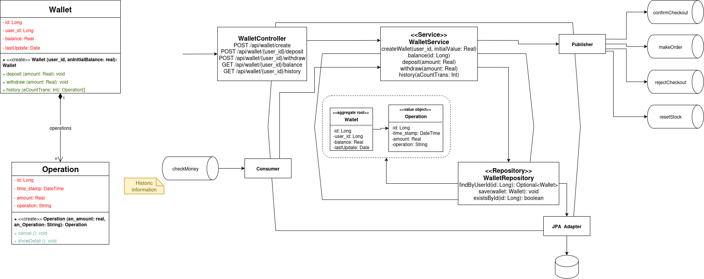

# wallet-manager

Aplicación para gestionar las wallets de un usuario.

## Funcionalidades

- `POST /wallet-manager/api/create`
  Crear una wallet para un usuario

- `GET /wallet-manager/api/{id_user}/balance`
  Consultar el saldo de una wallet por el ID del usuario

- `GET /wallet-manager/api/{id_user}/history`
  Consultar historial de transacciones de una wallet por el ID del usuario

- `POST /wallet-manager/api/{id_user}/deposit`
  Ingresar dinero en una wallet por el ID del usuario

- `POST /wallet-manager/api/{id_user}/withdraw`
  Retirar dinero de una wallet por el ID del usuario

## Diagrama hexagonal

## Tecnologías

- Java 17
- Spring Boot
- Spring Data JPA
- Spring Boot Security
- Lombok
- RabbitMQ
- Maven
- Docker
